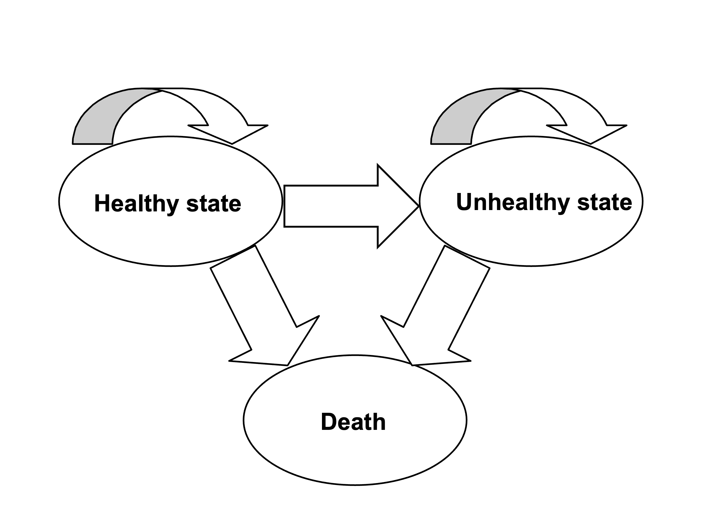

## Model Description

Consider a latent disease whereby there are three possible health states: "Healthy" (H), "Unhealthy" (U), and "Death" (D). A new treatment has been discovered that reduces the probability of disease carriers becoming unhealthy (though people must continue treatment even after they become unhealthy). You have been asked to conduct an economic appraisal of the costs and benefits of the treatment.

A randomized study found that 13 out of 1456 patients using the new treatment (T1) became unhealthy each year, compared to 26 out of 1464 patients in the control group, who received conventional management (T0). The risk of mortality was the same in each arm: 8 deaths out of 1825 healthy patients per year, and 9 deaths out of 1095 unhealthy patients per year. Once patients become unhealthy, they cannot become healthy again, but all patients start off as healthy carriers.

The cost of the new treatment is \$1,000 per year, and the cost of treating unhealthy patients is \$6,000 per year. There is no cost associated with healthy patients (aside from treatment, if received) or with death.

The health utility associated with healthy patients is 0.9. Unhealthy patients have a health utility of 0.4.

**Additional information**

-   All patients either receive the new treatment (T1) or conventional management (T0).
-   You may ignore discounting of costs and benefits associated with future events.
-   You do not need to include a half-cycle correction.
-   Assume that patients who die do so at the start of the year, after taking the treatment, and that there are no death costs.

3.1 Develop a Markov model to calculate the incremental cost-effectiveness of the new treatment (T1) versus conventional management (T0) over a time horizon of 20 years.

3.2 If the healthcare payer was willing to pay \$20,000 for 1 additional QALY, should they fund this new treatment?

**Markov model schematic:**



## Modeling

First we'll load some helpful packages.

```{r}
# Note the packages must first be installed with:
# install.packages("tidyverse")
# install.packages("heemod")

library(tidyverse)
library(heemod)
```

### Defining parameters

**Question: Fill in the parameters below using the information in the model description.**

```{r}
## Transition probabilities (annual)
p_HU_T0 <- 26/1464 # probability of becoming Unhealthy when Healthy, under conventional management (T0)
p_HU_T1 <- 13/1456 # probability of becoming Unhealthy when Healthy, under treatment (T1)

# Mortality is the same in both arms
p_HD <- 8/1825 # probability of dying when Healthy
p_UD <- 9/1095 # probability of dying when Unhealthy
```

Now we put all the parameters we've defined into the form `heemod` wants them in:

Note that the cost of the new treatment (`c_trt`) is defined separately from the state costs since only one treatment arm will be affected.

```{r}
param <- define_parameters(
# global parameters
r_discount = 0, # no discounting in this exercise

# transition probabilities
p_HU_T0 = p_HU_T0,
p_HU_T1 = p_HU_T1,
p_HD = p_HD,
p_UD = p_UD,

## State rewards
## Costs
c_H = 0, # annual cost of being Healthy (excluding any treatment cost)
c_U = 6000, # annual cost of being Unhealthy (excluding any treatment cost)
c_D = 0, # annual cost of being Dead
c_trt = 1000, # annual cost of the new treatment (T1), applies while a patient remains alive and on treatment

# Utilities
u_H = 0.9, # annual utility of being Healthy
u_U = 0.4, # annual utility of being Unhealthy
u_D = 0 # annual utility of being Dead
)
```

### Creating transition matrices

```{r}
states <- c("H", "U", "D")

# transition probability matrix for strategy T0 (conventional management)
mat_T0 <- define_transition( 
  C, p_HU_T0, p_HD,
  0, C, p_UD,
  0, 0, 1,
  state_names = states
)

# transition probability matrix for strategy T1 (new treatment)
mat_T1 <- define_transition( 
  C, p_HU_T1, p_HD,
  0, C, p_UD,
  0, 0, 1,
  state_names = states
)

plot(mat_T0) # visual checks
plot(mat_T1) 
```

### Defining states

The treatment cost `c_trt` is added to *both* the Healthy and Unhealthy state costs under T1, since patients start treatment while Healthy and must continue it even after becoming Unhealthy. Therefore, it is not added to the Death state, as there are no death costs in this exercise.

```{r}
## Conventional management (T0)
# Healthy
state_H <- define_state(
  cost = discount(c_H, r_discount),
  utility = discount(u_H, r_discount)
)
# Unhealthy
state_U <- define_state(
  cost = discount(c_U, r_discount),
  utility = discount(u_U, r_discount)
)
# Death
state_D <- define_state(
  cost = c_D,
  utility = u_D
)

## New treatment (T1)
# Healthy
state_H_T1 <- define_state(
  cost = discount(c_H + c_trt, r_discount),
  utility = discount(u_H, r_discount)
)
# Unhealthy
state_U_T1 <- define_state(
  cost = discount(c_U + c_trt, r_discount),
  utility = discount(u_U, r_discount)
)
# Death
state_D_T1 <- define_state(
  cost = c_D,
  utility = u_D
)
```

### Defining strategies

```{r}
## Conventional management (T0)
strat_T0 <- define_strategy(
 transition = mat_T0,
 H = state_H,
 U = state_U,
 D = state_D
)

## New treatment (T1)
strat_T1 <- define_strategy(
 transition = mat_T1,
 H = state_H_T1,
 U = state_U_T1,
 D = state_D_T1
)
```

The initial distribution between states in model cycle 0 also needs to be defined. All patients start in the Healthy state, and we again simulate a single patient so results are reported *per patient*.

```{r}
time0 <- define_init(H = 1, U = 0, D = 0) # initial state vector
```

### Run the model

```{r}
# run for 20 model cycles (years)
total_cycles <- 20

# model run
res_mod <- run_model(
    init = time0,
    cycles = total_cycles, 
    T0 = strat_T0, 
    T1 = strat_T1,
    parameters = param,
    cost = cost,
    effect = utility,
    method = "end" # no half-cycle correction; transitions occur at the end of each cycle
  )
```

First let's look at the Markov trace showing the probability distribution between states for each of the 20 model cycles.

```{r}
# Default heemod plot giving the proportion of patients in each model cycle
plot(res_mod)

# The same information but as data frames for each strategy
markov_trace <- get_counts(res_mod) 

markov_trace_T0 <- markov_trace %>% 
                        rename(strategy = .strategy_names, model_cycle = model_time, state
                               = state_names, proportion = count) %>% 
                    filter(strategy == "T0") %>% 
                    pivot_wider(names_from = state, values_from = proportion)

markov_trace_T1 <- markov_trace %>% 
                        rename(strategy = .strategy_names, model_cycle = model_time, state
                               = state_names, proportion = count) %>% 
                    filter(strategy == "T1") %>% 
                    pivot_wider(names_from = state, values_from = proportion)
```

Now let's look at the costs and QALYs for each model cycle in both strategies.

```{r}
cycle_payoffs <- get_values(res_mod)

cycle_payoffs_T0 <- cycle_payoffs %>% 
                          select(strategy = .strategy_names, model_cycle = model_time, payoffs
                                 = value_names, value) %>% 
                          filter(strategy == "T0") %>% 
                          pivot_wider(names_from = payoffs, values_from = value)

cycle_payoffs_T1 <- cycle_payoffs %>% 
                          select(strategy = .strategy_names, model_cycle = model_time, payoffs
                                 = value_names, value) %>% 
                          filter(strategy == "T1") %>% 
                          pivot_wider(names_from = payoffs, values_from = value)
```

Now, let's sum the model payoffs to get total costs and QALYs for each strategy.

```{r}
## Two different ways to get total costs and QALYS for each strategy
# 1. Using our payoffs data: 
knitr::kable(cycle_payoffs_T0 %>% 
    summarise(total_cost = sum(cost), total_QALY = sum(utility)) %>% 
      mutate(strategy = "T0"))

knitr::kable(cycle_payoffs_T1 %>% 
    summarise(total_cost = sum(cost), total_QALY = sum(utility)) %>% 
      mutate(strategy = "T1"))

# 2. Looking at the default outputs of the run_model function
summary(res_mod)

# Putting the incremental results in a prettier dataframe
icer <- summary(res_mod)$res_comp

icer <- icer %>%
            mutate(ref = "T0") %>%
            select(strategy = .strategy_names, ref, deltaCost = .dcost, deltaEffect = .deffect,
                   icer = .icer) %>%
            filter(strategy == "T1")

knitr::kable(icer)

# Combining the strategy totals and the incremental result into one table, as in the Excel solution
icer_table <- bind_rows(
    cycle_payoffs_T1 %>%
      summarise(Costs = sum(cost), QALYs = sum(utility)) %>%
      mutate(Comparator = "Treatment (T1)"),
    cycle_payoffs_T0 %>%
      summarise(Costs = sum(cost), QALYs = sum(utility)) %>%
      mutate(Comparator = "Conventional Management (T0)"),
    tibble(Comparator = "Incremental", Costs = icer$deltaCost, QALYs = icer$deltaEffect,
           `Cost per QALY` = icer$icer)
  ) %>%
  select(Comparator, Costs, QALYs, `Cost per QALY`) %>%
  mutate(`Cost per QALY` = ifelse(is.na(`Cost per QALY`), "-", as.character(round(`Cost per QALY`))))

knitr::kable(icer_table, digits = c(0, 0, 2, NA))
```

**Question: What is the ICER for the new treatment (T1) versus conventional management (T0)?**

**Question: The healthcare payer is willing to pay \$20,000 per additional QALY. Based on the ICER, should they fund the new treatment?**