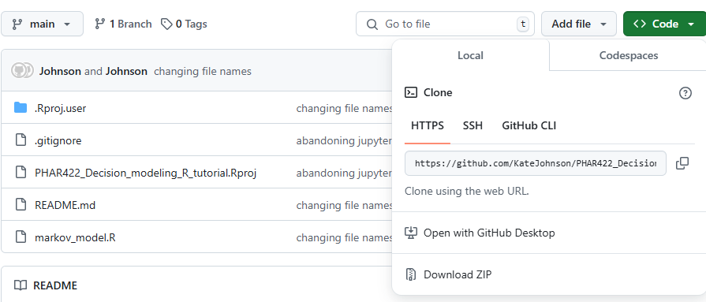

# PHAR422 Markov modeling in R tutorial (Fall 2024)

## Learning Objectives
- Construct a cohort-based Markov model in R
- Determine the ICER and evaluating cost-effectiveness relative to a willingness to pay threshold

## 1. Installation

We will be working on local installations of *R* and *RStudio*. If you do not already have them installed on your computer, follow these instructions:

### 1a. Install R
- Go to [CRAN](https://cran.r-project.org/).
- Download the installer for your operating system.
- Run the installer and accept the default options unless your course specifies otherwise.

### 1b. Install RStudio
- After installing R, download [RStudio Desktop](https://posit.co/download/rstudio-desktop/).
- Choose the correct installer for your OS.
- Complete the installation using the default settings.

---

**Note:** For more detailed instructions, visit the [UBC MDS installation guide](https://ubc-mds.github.io/resources_pages/installation_instructions/).  
Select your OS and then review the sections for **R**, **XQuartz**, **IRkernel**, and **RStudio**.  
You only need the first paragraph of instructions for each.

---

**Please have R and RStudio installed before the start of class.**

## 2. Download a local version of this repository

- Go to https://github.com/KateJohnson/PHAR422_Markov_modeling_R_tutorial
- Under the green 'code' button (top right), 'download ZIP' to download a local copy of the entire repository and its contents

- Unzip and open the repository from your downloads folder
- We will work on `Markov_Model_Solutions.qmd`

*Note: you may want to move the R project folder out of your downloads folder to a more logical place, such as where you store 
class materials on your computer. You can do that within finder by dragging and dropping the entire folder to your preferred location.
